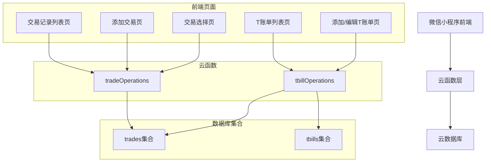
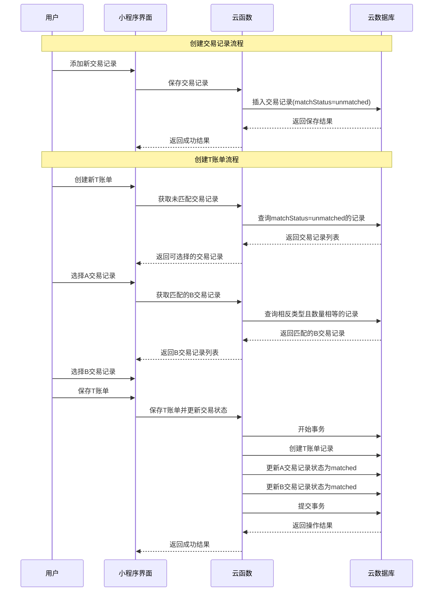
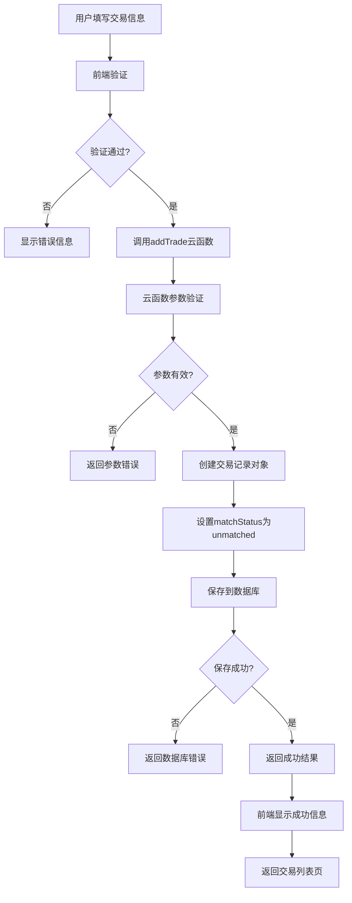
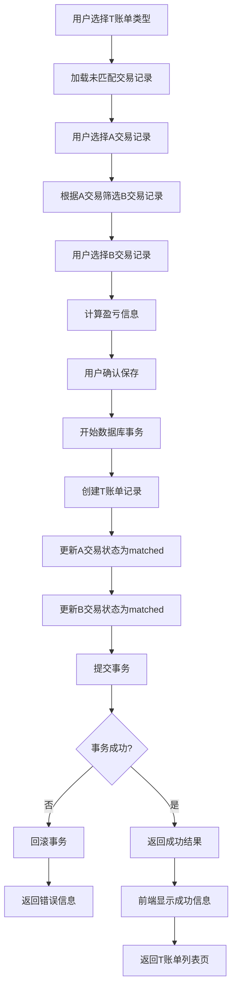
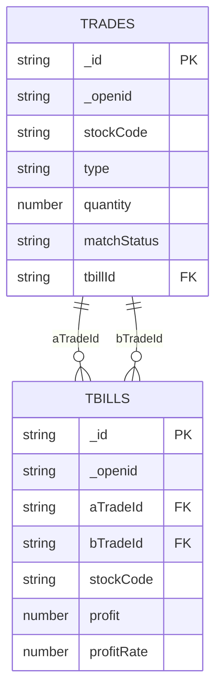
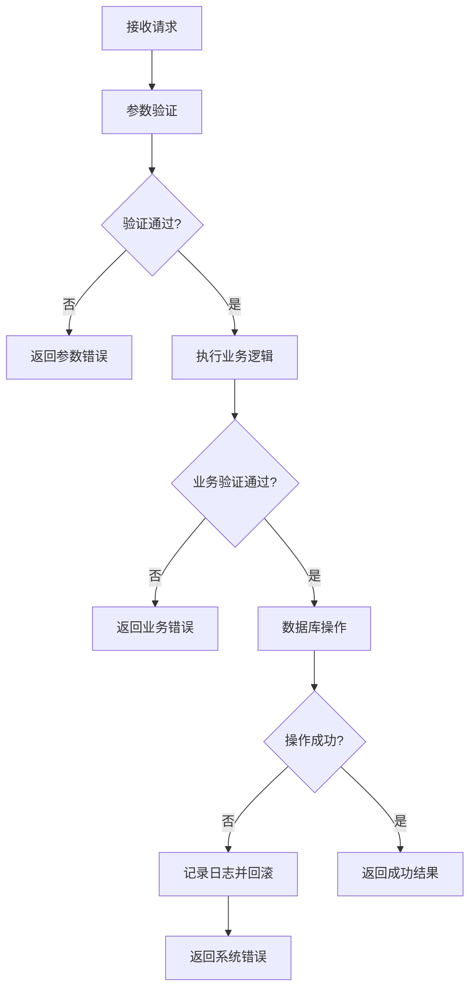

# 设计文档

## 概述

本设计文档描述了如何改造现有的T账单系统，从自动匹配交易记录改为手动选择交易记录的模式。新系统将允许用户精确控制T账单的创建，通过选择特定的A和B交易记录来计算盈亏，确保数量匹配和状态管理的准确性。

## 架构

### 系统架构图



### 数据流架构



### 核心业务流程

#### 交易记录创建流程



#### T账单创建流程



## 组件和接口

### 数据模型

#### 交易记录模型 (Trade)
```javascript
{
  _id: String,           // 数据库自动生成的ID
  _openid: String,       // 用户标识
  id: Number,            // 业务ID (时间戳)
  stockCode: String,     // 股票代码
  stockName: String,     // 股票名称
  stockMarket: String,   // 股票市场 (A股/港股/美股)
  type: String,          // 交易类型 (buy/sell)
  price: Number,         // 交易价格
  quantity: Number,      // 交易数量
  amount: Number,        // 交易金额
  date: String,          // 交易日期 (YYYY-MM-DD)
  matchStatus: String,   // 匹配状态 (unmatched/matched)
  tbillId: String,       // 关联的T账单ID (如果已匹配)
  createTime: Date,      // 创建时间
  updateTime: Date       // 更新时间
}
```

#### T账单模型 (TBill)
```javascript
{
  _id: String,           // 数据库自动生成的ID
  _openid: String,       // 用户标识
  id: Number,            // 业务ID (时间戳)
  stockCode: String,     // 股票代码
  stockName: String,     // 股票名称
  stockMarket: String,   // 股票市场
  tType: String,         // T账单类型 (buySell/sellBuy)
  aTradeId: String,      // A交易记录ID
  bTradeId: String,      // B交易记录ID
  quantity: Number,      // 交易数量 (A和B相等)
  profit: Number,        // 盈利金额
  profitRate: Number,    // 盈利率 (%)
  date: String,          // T账单日期
  completed: Boolean,    // 是否完成 (固定为true)
  createTime: Date,      // 创建时间
  updateTime: Date       // 更新时间
}
```

### 云函数接口

#### tradeOperations 云函数修改和新增操作

```javascript
// 修改现有的添加交易记录操作
case 'addTrade':
  // 参数: { stockCode, stockName, type, price, quantity, date, ... }
  // 新增逻辑: 自动设置 matchStatus: 'unmatched'
  // 移除逻辑: 不再执行自动匹配计算
  // 返回: { success: Boolean, data: Trade }

// 修改现有的获取交易记录操作
case 'getAllTrades':
  // 新增: 返回数据包含 matchStatus 字段
  // 返回: { success: Boolean, data: Trade[] }

// 获取未匹配的交易记录
case 'getUnmatchedTrades':
  // 参数: { stockCode?: String, type?: String }
  // 返回: { success: Boolean, data: Trade[] }

// 获取匹配的B交易记录
case 'getMatchingBTrades':
  // 参数: { aTradeId: String }
  // 返回: { success: Boolean, data: Trade[] }

// 更新交易记录匹配状态
case 'updateTradeMatchStatus':
  // 参数: { tradeId: String, matchStatus: String, tbillId?: String }
  // 返回: { success: Boolean }

// 检查交易记录是否可编辑
case 'checkTradeEditable':
  // 参数: { tradeId: String }
  // 返回: { success: Boolean, editable: Boolean, reason?: String }
```

#### tbillOperations 云函数 (新建)

```javascript
// 创建T账单
case 'createTBill':
  // 参数: { aTradeId: String, bTradeId: String, date: String }
  // 返回: { success: Boolean, data: TBill }

// 更新T账单
case 'updateTBill':
  // 参数: { tbillId: String, aTradeId: String, bTradeId: String }
  // 返回: { success: Boolean, data: TBill }

// 删除T账单
case 'deleteTBill':
  // 参数: { tbillId: String }
  // 返回: { success: Boolean }

// 获取T账单详情
case 'getTBillDetail':
  // 参数: { tbillId: String }
  // 返回: { success: Boolean, data: TBillDetail }
```

### 前端组件

#### 交易记录表单组件 (TradeForm)
```javascript
// 组件属性
properties: {
  mode: String,          // 'create' 或 'edit'
  tradeId: String        // 编辑模式下的交易ID
}

// 组件数据
data: {
  stockCode: String,     // 股票代码
  stockName: String,     // 股票名称
  type: String,          // 交易类型 (buy/sell)
  price: Number,         // 交易价格
  quantity: Number,      // 交易数量
  date: String,          // 交易日期
  matchStatus: String,   // 匹配状态 (只读)
  editable: Boolean      // 是否可编辑
}

// 组件方法
methods: {
  loadTradeDetail(),     // 加载交易详情 (编辑模式)
  validateForm(),        // 表单验证
  saveTrade(),          // 保存交易记录
  checkEditable()       // 检查是否可编辑
}

// 组件事件
events: {
  'trade-saved': { tradeId, tradeData },
  'edit-blocked': { reason }
}
```

#### 交易选择组件 (TradeSelector)
```javascript
// 组件属性
properties: {
  tradeType: String,     // 'buy' 或 'sell'
  stockCode: String,     // 股票代码过滤
  excludeIds: Array,     // 排除的交易ID列表
  quantityFilter: Number // 数量过滤
}

// 组件方法
methods: {
  loadTrades(),          // 加载交易记录
  selectTrade(tradeId),  // 选择交易记录
  refreshList()          // 刷新列表
}

// 组件事件
events: {
  'trade-selected': { tradeId, tradeData }
}
```

#### T账单表单组件 (TBillForm)
```javascript
// 组件属性
properties: {
  mode: String,          // 'create' 或 'edit'
  tbillId: String        // 编辑模式下的T账单ID
}

// 组件数据
data: {
  tType: String,         // T账单类型
  aTrade: Object,        // 选择的A交易
  bTrade: Object,        // 选择的B交易
  profit: Number,        // 计算的盈利
  profitRate: Number     // 计算的盈利率
}

// 组件方法
methods: {
  selectATrade(),        // 选择A交易
  selectBTrade(),        // 选择B交易
  calculateProfit(),     // 计算盈利
  saveTBill()           // 保存T账单
}
```

## 数据模型

### 数据库集合设计

#### trades 集合索引
```javascript
// 复合索引
{ _openid: 1, matchStatus: 1, type: 1 }
{ _openid: 1, stockCode: 1, matchStatus: 1 }
{ _openid: 1, date: -1 }

// 单字段索引
{ tbillId: 1 }
```

#### tbills 集合索引
```javascript
// 复合索引
{ _openid: 1, date: -1 }
{ _openid: 1, stockCode: 1 }

// 单字段索引
{ aTradeId: 1 }
{ bTradeId: 1 }
```

### 数据关系



## 错误处理

### 错误类型定义

```javascript
const ErrorTypes = {
  TRADE_NOT_FOUND: 'TRADE_NOT_FOUND',
  TRADE_ALREADY_MATCHED: 'TRADE_ALREADY_MATCHED',
  QUANTITY_MISMATCH: 'QUANTITY_MISMATCH',
  STOCK_CODE_MISMATCH: 'STOCK_CODE_MISMATCH',
  INVALID_TRADE_TYPE: 'INVALID_TRADE_TYPE',
  TBILL_NOT_FOUND: 'TBILL_NOT_FOUND',
  DATABASE_ERROR: 'DATABASE_ERROR',
  PERMISSION_DENIED: 'PERMISSION_DENIED'
}
```

### 错误处理策略

1. **数据验证错误**: 在云函数入口进行参数验证，返回具体的错误信息
2. **业务逻辑错误**: 在业务逻辑层捕获并转换为用户友好的错误信息
3. **数据库错误**: 记录详细日志，向用户返回通用错误信息
4. **事务回滚**: 使用数据库事务确保数据一致性

### 错误处理流程



## 测试策略

### 单元测试

1. **云函数测试**
   - 参数验证测试
   - 业务逻辑测试
   - 数据库操作测试
   - 错误处理测试

2. **前端组件测试**
   - 组件渲染测试
   - 用户交互测试
   - 数据绑定测试
   - 事件处理测试

### 集成测试

1. **端到端流程测试**
   - 创建T账单完整流程
   - 编辑T账单完整流程
   - 删除T账单完整流程
   - 交易记录状态变更流程

2. **数据一致性测试**
   - 并发操作测试
   - 事务回滚测试
   - 数据同步测试

### 性能测试

1. **数据库查询性能**
   - 大量数据下的查询性能
   - 索引效果验证
   - 复杂查询优化

2. **用户界面性能**
   - 列表渲染性能
   - 数据加载性能
   - 用户交互响应性能

### 测试数据准备

```javascript
// 测试用交易记录
const testTrades = [
  {
    stockCode: '000001',
    stockName: '平安银行',
    type: 'buy',
    price: 10.50,
    quantity: 1000,
    matchStatus: 'unmatched'
  },
  {
    stockCode: '000001',
    stockName: '平安银行',
    type: 'sell',
    price: 11.20,
    quantity: 1000,
    matchStatus: 'unmatched'
  }
]

// 测试用T账单
const testTBill = {
  stockCode: '000001',
  stockName: '平安银行',
  tType: 'buySell',
  aTradeId: 'trade_1',
  bTradeId: 'trade_2',
  quantity: 1000,
  profit: 700,
  profitRate: 6.67
}
```